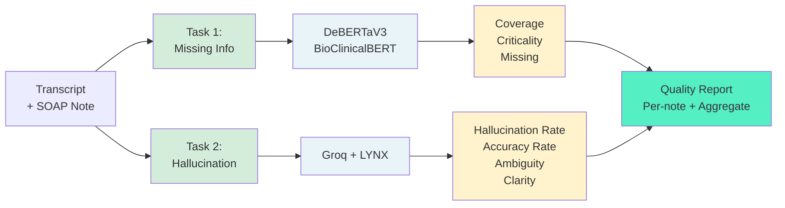
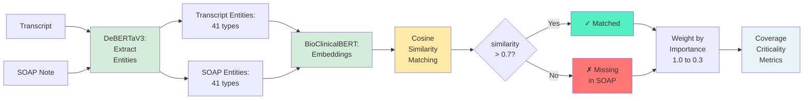
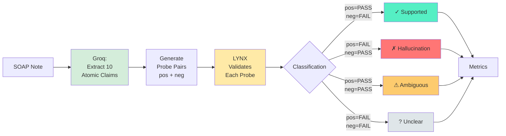

# SOAP-QualitySuite
*Framework for evaluating AI-generated SOAP notes via NER validation and LLM-based Detect missing information, hallucinations, and clinical accuracy issues.*
| Notebook Title                             | Link                                                                 |
|-------------------------------------------|----------------------------------------------------------------------|
| **SOAP-Quality Suite**                    | [](https://colab.research.google.com/drive/172aCg3kbbOIz5b8Y3N5iHi_xL_wheHrA?usp=sharing) |
| **Synthetic Hallucination Dataset Generator** | [](https://colab.research.google.com/drive/1MfH24U08yyAt9iZFKZxViKEzoYe4-t57?usp=sharing) |

This framework evaluates AI-generated clinical notes by comparing them to source transcripts. It addresses three critical quality issues:

1. **Missing Critical Findings** - Important clinical information omitted from notes
2. **Hallucinated Facts** - Information not grounded in the transcript
3. **Clinical Accuracy Issues** - Medically incorrect, misleading, or contextually wrong statements (negation, laterality, temporal, dosage errors)

**Hybrid Approach**: Fast deterministic NER (Task 1) detects missing information, while LLM-as-judge with chain-poll validation (Task 2) catches hallucinations and clinical accuracy issues.

**Performance**: 134.7 seconds for 10 notes (~13.4s/note) on single T4 GPU. Task 2 (LLM Reasoning) is the bottleneck; can be 2-3x faster with optimized serving (Groq) or lighter models.

**Result files**:
| File Name                        | GitHub Link                                                                 |
|----------------------------------|------------------------------------------------------------------------------|
| **ner_evaluation_summary.csv**   | [View on GitHub](https://github.com/snehitvaddi/SOAP-QualitySuite/blob/main/ner_evaluation_summary.csv) |
| **ner_entity_matches.csv**       | [View on GitHub](https://github.com/snehitvaddi/SOAP-QualitySuite/blob/main/ner_entity_matches.csv) |
| **lynx_per_note_summary.csv**    | [View on GitHub](https://github.com/snehitvaddi/SOAP-QualitySuite/blob/main/lynx_per_note_summary.csv) |
| **lynx_hallucination_results.csv** | [View on GitHub](https://github.com/snehitvaddi/SOAP-QualitySuite/blob/main/lynx_hallucination_results.csv) |
---

## Overall Architecture



**Pipeline**: Loads transcript-SOAP pairs → runs both tasks → generates per-note and aggregate metrics → outputs CSVs and logs.

---

## Task 1: NER Entity Validation

**Goal**: Identify missing medical entities using deterministic NER and semantic matching.



**Method**:
1. **Extract entities** from transcript and SOAP using `DeBERTaV3 BioMed`
   - **Why DeBERTaV3 BioMed**: Achieves F1 0.85 on medical NER with 86M params (smaller than BioBERT 110M, faster than ModernBERT 149M). Off-the-shelf ready, no fine-tuning needed. Recognizes 41 biomedical entity types including medications, diagnoses, symptoms, procedures, laterality, temporal markers.
   
2. **Generate embeddings** with `BioClinicalBERT`
   - **Why BioClinicalBERT**: Pre-trained on 2M+ MIMIC-III clinical notes (actual doctor-patient conversations), not PubMed abstracts. Excels at semantic validation and clinical reasoning. Handles medical synonyms naturally (hypertension ↔ high blood pressure, MI ↔ myocardial infarction, SOB ↔ shortness of breath).

3. **Match via cosine similarity** (threshold 0.7) to handle synonyms and abbreviations

4. **Weight by clinical importance** for criticality scoring (medications (1.0), diagnoses (0.9), procedures/tests (0.7), symptoms (0.5), and contextual details like anatomy or timing (0.3)) to prioritize evaluation fidelity.


**Why Weighting Matters**: Missing "metformin" (medication, weight=1.0) is clinically critical and could lead to treatment errors, while missing "left" in "left knee pain" (laterality, weight=0.3) is less severe if context is clear. Criticality scoring prioritizes flagging high-risk omissions for human review.
## Metrics Developed

| Metric | Formula | Interpretation | Good Target |
|--------|---------|---------------|-------------|
| **Coverage Score** | `(Matched_Entities / Total_Transcript_Entities) × 100` | % of transcript information captured in SOAP | >75% |
| **Criticality Score** | `(Σ Weight_Matched / Σ Weight_Total) × 100` | % of *important* info captured (weighted) | >80% |
| **Missing Critical** | `Count where weight ≥ 0.9` | High-priority missing (meds, diagnoses) | <2 per note |

**Example Calculation**:
```
Note #42: Transcript has 10 entities, SOAP has 7
Matched: metformin(1.0), hypertension(0.9), chest pain(0.5), BP reading(0.7)
Missing: lisinopril(1.0), CAD family hx(0.9), fatigue(0.5)

Coverage = 4 matched / 7 relevant = 57.1%
Criticality = (1.0+0.9+0.5+0.7) / (1.0+1.0+0.9+0.9+0.5+0.7+0.5) = 3.1/5.5 = 56.4%
Missing Critical = 2 (lisinopril, CAD family hx both ≥0.9)

→ Red flag: Low coverage (57%) + 2 critical entities missing (medications/diagnosis)
```

<details>
    
**Detailed Example**</br>
**Clinical Scenario**:
```
Transcript: 
"Patient is a 58-year-old male with type 2 diabetes mellitus. 
He reports persistent chest pain radiating to left arm for past 3 days. 
Currently taking metformin 1000mg twice daily. 
Blood pressure today is 142/88 mmHg. 
Family history significant for coronary artery disease."

SOAP Note:
"58M with DM2. Reports chest discomfort x 3 days. 
On metformin 1g BID. 
BP 142/88."
```

**Task 1 Analysis**:
```
Extracted from Transcript (12 entities):
- "type 2 diabetes mellitus" (DIAGNOSIS, weight=0.9, conf=0.94)
- "chest pain" (SYMPTOM, weight=0.5, conf=0.91)
- "left arm" (ANATOMY, weight=0.3, conf=0.88)
- "3 days" (TEMPORAL, weight=0.3, conf=0.85)
- "metformin" (MEDICATION, weight=1.0, conf=0.96)
- "1000mg" (DOSAGE, weight=1.0, conf=0.89)
- "twice daily" (FREQUENCY, weight=1.0, conf=0.87)
- "142/88 mmHg" (VITAL, weight=0.7, conf=0.92)
- "coronary artery disease" (DIAGNOSIS, weight=0.9, conf=0.93)
- "family history" (CONTEXT, weight=0.5, conf=0.86)

Extracted from SOAP (7 entities):
- "DM2" (DIAGNOSIS, weight=0.9, conf=0.91)
- "chest discomfort" (SYMPTOM, weight=0.5, conf=0.89)
- "3 days" (TEMPORAL, weight=0.3, conf=0.84)
- "metformin" (MEDICATION, weight=1.0, conf=0.95)
- "1g BID" (DOSAGE+FREQUENCY, weight=1.0, conf=0.88)
- "BP 142/88" (VITAL, weight=0.7, conf=0.91)

Semantic Matching:
✓ "DM2" ↔ "type 2 diabetes mellitus" (similarity=0.91)
✓ "chest discomfort" ↔ "chest pain" (similarity=0.87)
✓ "metformin" ↔ "metformin" (similarity=0.99)
✓ "1g BID" ↔ "1000mg twice daily" (similarity=0.93)
✓ "BP 142/88" ↔ "142/88 mmHg" (similarity=0.95)
✓ "3 days" ↔ "3 days" (similarity=0.98)

Missing in SOAP:
✗ "left arm" (ANATOMY, weight=0.3) - radiation detail
✗ "coronary artery disease" (DIAGNOSIS, weight=0.9) - family history
✗ "family history" (CONTEXT, weight=0.5) - risk context
```

**Metrics**:
```
Coverage Score = Matched/Total × 100
              = 6/10 × 100 = 60.0%

Criticality Score = Matched_Weight/Total_Weight × 100
                  = (0.9 + 0.5 + 1.0 + 1.0 + 0.7 + 0.3) / 
                    (0.9 + 0.5 + 0.3 + 0.3 + 1.0 + 1.0 + 1.0 + 0.7 + 0.9 + 0.5) × 100
                  = 4.4/7.1 × 100 = 62.0%

Missing Critical: 1 (coronary artery disease, weight=0.9)
Missing Moderate: 0
Missing Low: 3 (left arm, family history, radiation details)
```

**Interpretation**: Coverage is low (60%) but criticality is acceptable (62%) because the most important clinical facts are preserved. The missing "coronary artery disease" family history is flagged as critical for review - it's relevant risk stratification for chest pain evaluation.

</details>

## Task 2: LYNX Hallucination Detection and Accuracy Check

**Goal**: Detect **hallucinated facts** and **clinical accuracy issues** (negation errors, wrong laterality, incorrect temporal info, dosage mistakes) using an LLM-as-judge approach inspired by chain-poll validation.



**Why This Approach:**
- **Catches nuanced errors**: Negation ("denies" vs "reports"), laterality ("left" vs "right"), temporal precision ("2 weeks" vs "2 months"), dosage correctness
- **Medical domain specialization**: [LYNX-8B](https://huggingface.co/PatronusAI/Llama-3-Patronus-Lynx-8B-Instruct) fine-tuned specifically for clinical hallucination detection, outperforms general LLMs.
- **Questioning to avoid bias**: Asks both positive and negative probes to avoid confirmation bias, validates from multiple angles uisng [Groq GPT-OSS-20B](https://console.groq.com/docs/model/openai/gpt-oss-20b) reasoning model.
**Lightweight Design**: Instead of asking a single LLM to judge everything, we decompose SOAP notes into atomic claims, generate targeted question-answer pairs with negations, and use a specialized lightweight model (LYNX-8B) for binary validation. This is faster and more accurate than end-to-end prompting of large models.

### Method

1. **Extract atomic claims** using `Groq GPT-OSS-20B`
   - Decompose SOAP note into 10 atomic, verifiable claims
   - Categorize by type: medications, diagnoses, symptoms, vitals, procedures, family_history, social_history, allergies, laterality, temporal, negation

2. **Generate probe pairs** 
   
   For each claim, create two probes:
   
   **Positive Probe** (tests if claim is supported):
   ```
   q_pos: "Does the patient report chest pain?"
   a_pos: "Yes, the patient reports chest pain"
   ```
   
   **Negative Probe** (tests if claim is contradicted):
   ```
   q_neg: "Does the patient deny chest pain?"
   a_neg: "Yes, the patient denies chest pain"
   ```

3. **Validate with LYNX** (8B hallucination detector)
   - Feed transcript as context + each probe (q + a pair)
   - LYNX returns: `{"REASONING": "...", "SCORE": "PASS"/"FAIL"}`
   - PASS = answer is faithful to transcript
   - FAIL = answer contradicts or unsupported by transcript

4. **Classify claims** based on probe results:
   ```
   pos=PASS, neg=FAIL → Supported ✓    (claim is true)
   pos=FAIL, neg=PASS → Hallucination ✗ (claim is false)
   pos=PASS, neg=PASS → Ambiguous ⚠    (evidence unclear)
   pos=FAIL, neg=FAIL → Unclear ?      (both probes fail)
   ```

**Why both probes?** Asking only positive questions risks confirmation bias—the model might weakly agree even when evidence is absent. Negative probes force explicit contradiction checking. If both pass (ambiguous), it signals the transcript contains conflicting or incomplete information requiring human review.

**Example**:
```
Transcript: "I've had right knee pain about 2 weeks..."
SOAP claim: "Patient reports right knee pain for 2 weeks"

Probe Results:
q_pos: "Does patient report right knee pain?" → PASS ✓
q_neg: "Does patient deny knee pain?" → FAIL ✗

Result: SUPPORTED ✓
```

| Metric | Formula | Interpretation | Good Target |
|--------|---------|---------------|-------------|
| **Hallucination Rate** | `(Hallucinations / Total_Claims) × 100` | % of fabricated/wrong information | <10% |
| **Accuracy Rate** | `(Supported / Total_Claims) × 100` | % of verified claims | >80% |
| **Ambiguity Rate** | `((Ambiguous + Unclear) / Total) × 100` | % of uncertain claims | <20% |
| **Overall Clarity** | `Accuracy - (Ambiguity × 0.5)` | Composite quality score | >70% |

`Note: The 0.5 multiplier in Overall Clarity means:

Each ambiguous claim counts as half a problem
We penalize uncertainty, but less severely than fabrication`

**Example Calculation**:
```
Note #42: 10 claims extracted from SOAP
Classification: 6 Supported, 3 Hallucination, 1 Ambiguous

Hallucination Rate = 3/10 × 100 = 30.0%  ← High! Problem note
Accuracy Rate = 6/10 × 100 = 60.0%
Ambiguity Rate = 1/10 × 100 = 10.0%
Overall Clarity = 60.0 - (10.0 × 0.5) = 55.0%  ← Below 70% target

Hallucinations found:
- "Patient denies chest pain" (negation error: actually REPORTS it)
- "Symptoms for 1 month" (temporal error: actually 2 weeks)  
- "Lisinopril 20mg" (dosage error: actually 10mg)

→ Red flag: 30% hallucination rate + clinical accuracy errors (negation/temporal/dosage)
```
---
## Metrics Summary

| Task | Metric | Formula | Good Target |
|------|--------|---------|-------------|
| **Task 1** | Coverage | Matched / Total × 100 | >75% |
| | Criticality | Weighted Matched / Total × 100 | >80% |
| | Missing Critical | Count (weight ≥ 0.9) | <2 per note |
| **Task 2** | Hallucination Rate | Hallucinations / Claims × 100 | <10% |
| | Accuracy Rate | Supported / Claims × 100 | >80% |
| | Clarity Score | Accuracy − (Ambiguity × 0.5) | >70% |

---

## Models & Providers

| Task | Component | Model | Params | Provider |
|------|-----------|-------|--------|----------|
| 1 | NER | `Helios9/BioMed_NER` (DeBERTaV3) | 86M | HuggingFace |
| 1 | Embeddings | `Bio_ClinicalBERT` | 110M | HuggingFace |
| 2 | Claims | `openai/gpt-oss-20b (Groq)` | 20B | Groq |
| 2 | Validation | `Llama-3-Patronus-Lynx-8B` | 8B | HuggingFace |

**Model Selection Rationale**:
- **DeBERTaV3**: F1 0.82-0.88, off-the-shelf, 41 entity types
- **BioClinicalBERT**: Trained on 2M MIMIC-III notes, handles medical synonyms
- **LYNX**: 97% accuracy on hallucination detection benchmarks
- **Groq GPT-OSS-20B**: Lightweight open-weight reasoning model served via Groq, optimized for ultra-low latency and agentic tool use at scale.

---

## How to Run

### Quick Start (Google Colab)

1. Click Colab badge above
2. Get API keys:
   - HuggingFace: https://huggingface.co/settings/tokens
   - Groq: https://console.groq.com/keys
3. Set keys in configuration cell:
```python
HugFace_DeepScribe = "hf_your_key"
Groq_DeepScribe = "gsk_your_key"
```
4. Run all cells

### Local Execution

```bash
# Install dependencies
pip install -r requirements.txt

# Set API keys (lines 40-41 in integrated_task1_task2_pipeline_v2.py)
# Run evaluation

# View results
ls *.csv  # Output files
```

### Key Parameters

| Parameter | Default | Description | When to Adjust |
|-----------|---------|-------------|----------------|
| `NUM_SAMPLES` | 10 | Notes to process | Increase for full eval (100) |
| `CONFIDENCE_THRESHOLD` | 0.5 | NER confidence min | 0.7 for precision, 0.4 for recall |
| `SIMILARITY_THRESHOLD` | 0.7 | Entity matching min | 0.8 strict, 0.6 lenient |
| `MAX_CONCURRENT` | 20 | Parallel LYNX calls | Increase to 30 for faster Task 2 |

---

## Output Files

```
ner_evaluation_summary.csv        # Task 1 per-note metrics
ner_entity_matches.csv            # Task 1 detailed matches
lynx_per_note_summary.csv         # Task 2 per-note metrics
lynx_hallucination_results.csv    # Task 2 detailed claims
task1_ner_evaluation.log          # Task 1 debug log
task2_lynx_evaluation.log         # Task 2 debug log
```

**Example Output**:
```csv
document_id,coverage_score,criticality_score,hallucination_rate
0,78.5%,82.3%,20.0%
1,82.1%,85.7%,10.0%
2,65.3%,71.2%,30.0%  ← Problematic note
```

---

## Strengths & Limitations

### ✅ Where This Excels

**Comprehensive Coverage**
- Task 1: Catches missing medications, diagnoses (entity-level)
- Task 2: Catches fabricated facts, negation errors, wrong laterality (context-level)
- Complementary strengths cover each other's weaknesses

**Production-Ready**
- No ground truth needed (compares to transcript directly)
- Per-note granularity identifies specific problems
- Auditable with detailed reasoning

**Medical Domain**
- Models trained on clinical notes (MIMIC-III)
- Handles medical synonyms, abbreviations
- 41 entity types + clinical categories (meds, laterality, temporal, negation)

### ⚠️ Limitations

**Semantic Matching (Task 1)**
- May match "diabetes" with "family history of diabetes" (context matters)
- May miss abbreviations if similarity < threshold (e.g., "HTN" vs "hypertension" = 0.65)
- Mitigation: Tune threshold, add abbreviation expansion

**Context in Entity Matching**
- Task 1 matches entities individually
- Example: Misses negation in "denies chest pain" vs "reports chest pain" at NER phase
- Mitigation: Task 2 compensates by checking negation explicitly as a category

**LLM Variability (Task 2)**
- Could show inconsistency across runs due to LLM stochasticity
- Ambiguous category can be 10-20% of claims
- Mitigation: temperature=0, multiple runs for critical decisions

**No Medical Knowledge Base**
- Can't validate dosages against FDA guidelines
- Misses "aspirin 5000mg" as dangerous if in transcript
- Future: Integrate FDA dosage guidelines, drug interaction databases

**Truncation**
- Task 1 truncates at ~2000 chars ((DeBERTa, BioClinical's context window is 512 tokens)
- Solution: Increase MAX_TEXT_LENGTH or sliding window or use larger context LLM.

**Performance Bottleneck**
- Task 2 (LYNX LLM) takes majority of 13.4s/note
- Current: HuggingFace router (slower)
- Improvement: Groq serving (3x faster), or lighter fine-tuned model
---

## Alternative Approaches Evaluated

- **Teacher-Student CoT**: Student validates, teacher verifies with chain-of-thought  
  Unpredictable latency (CoT varies tokens), 3–5× cost, cascading errors.

- **Logprobs Confidence**: Use token log-probabilities to measure confidence  
  Delta between positive/negative answers, difference is too small, no clear threshold.

- **RAG Cosine Similarity**: Embed claims and transcript, use similarity threshold  
  "reports pain" vs "denies pain" yields 0.94 similarity in some cases, opposite meanings too close.
---
## License & Citation

MIT License. Built with models from HuggingFace:
- `Helios9/BioMed_NER` (DeBERTaV3)
- `emilyalsentzer/Bio_ClinicalBERT`
- `PatronusAI/Llama-3-Patronus-Lynx-8B`

Dataset: `adesouza1/soap_notes` (HuggingFace)

---

**Built for improving AI clinical documentation quality 🏥**
