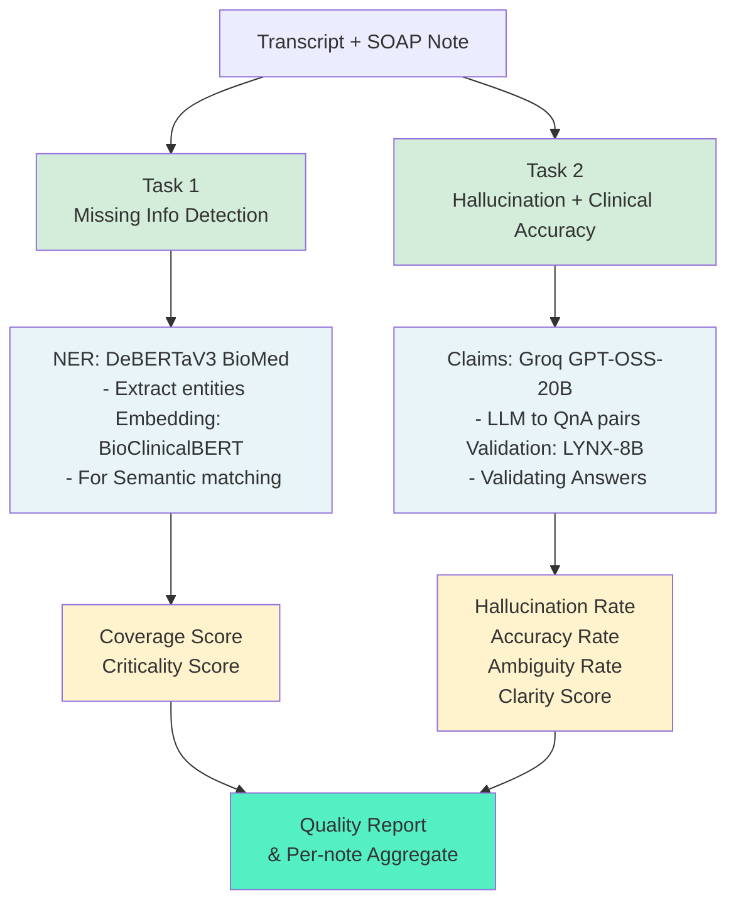
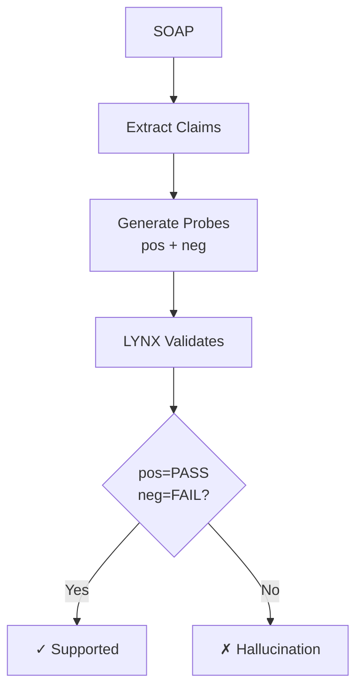

# SOAP-QualitySuite
*Framework for evaluating AI-generated SOAP notes via NER validation and LLM-based Detect missing information, hallucinations, and clinical accuracy issues.*

[](https://colab.research.google.com/drive/172aCg3kbbOIz5b8Y3N5iHi_xL_wheHrA?usp=sharing)

This framework evaluates AI-generated clinical notes by comparing them to source transcripts. It addresses three critical quality issues:

1. **Missing Critical Findings** - Important clinical information omitted from notes
2. **Hallucinated Facts** - Information not grounded in the transcript
3. **Clinical Accuracy Issues** - Medically incorrect, misleading, or contextually wrong statements (negation, laterality, temporal, dosage errors)

**Hybrid Approach**: Fast deterministic NER (Task 1) detects missing information, while LLM-as-judge with chain-poll validation (Task 2) catches hallucinations and clinical accuracy issues.

**Performance**: 134.7 seconds for 10 notes (~13.4s/note) on single T4 GPU. Task 2 (LLM polling) is the bottleneck; can be 2-3x faster with optimized serving (Groq) or lighter models.

---

## Architecture



**Pipeline**: Loads transcript-SOAP pairs → runs both tasks → generates per-note and aggregate metrics → outputs CSVs and logs.

---

## Task 1: NER Entity Validation

**Goal**: Identify missing medical entities using deterministic NER and semantic matching.

**Method**:
1. **Extract entities** from transcript and SOAP using `DeBERTaV3 BioMed`
   - **Why DeBERTaV3 BioMed**: Achieves F1 0.85 on medical NER with 86M params (smaller than BioBERT 110M, faster than ModernBERT 149M). Off-the-shelf ready, no fine-tuning needed. Recognizes 41 biomedical entity types including medications, diagnoses, symptoms, procedures, laterality, temporal markers.
   
2. **Generate embeddings** with `BioClinicalBERT`
   - **Why BioClinicalBERT**: Pre-trained on 2M+ MIMIC-III clinical notes (actual doctor-patient conversations), not PubMed abstracts. Excels at semantic validation and clinical reasoning. Handles medical synonyms naturally (hypertension ↔ high blood pressure, MI ↔ myocardial infarction, SOB ↔ shortness of breath).

3. **Match via cosine similarity** (threshold 0.7) to handle synonyms and abbreviations

4. **Weight by clinical importance** for criticality scoring
```
High-priority (weight 1.0):
- MEDICATION, DRUG (e.g., metformin, aspirin, lisinopril)

Critical (weight 0.9):
- DIAGNOSIS, DISEASE, DISORDER (e.g., diabetes, hypertension, CAD)

Moderate (weight 0.7):
- PROCEDURE, TEST, TREATMENT (e.g., MRI, blood test, physical therapy)

Lower (weight 0.5):
- SYMPTOM, SIGN (e.g., headache, fever, fatigue)

Contextual (weight 0.3):
- ANATOMY, LATERALITY, TEMPORAL (e.g., left knee, 2 weeks ago)
```

**Why Weighting Matters**: Missing "metformin" (medication, weight=1.0) is clinically critical and could lead to treatment errors, while missing "left" in "left knee pain" (laterality, weight=0.3) is less severe if context is clear. Criticality scoring prioritizes flagging high-risk omissions for human review.
## Metrics Developed

| Metric | Formula | Interpretation | Good Target |
|--------|---------|---------------|-------------|
| **Coverage Score** | `(Matched_Entities / Total_Transcript_Entities) × 100` | % of transcript information captured in SOAP | >75% |
| **Criticality Score** | `(Σ Weight_Matched / Σ Weight_Total) × 100` | % of *important* info captured (weighted) | >80% |
| **Missing Critical** | `Count where weight ≥ 0.9` | High-priority missing (meds, diagnoses) | <2 per note |

**Example Calculation**:
```
Note #42: Transcript has 10 entities, SOAP has 7
Matched: metformin(1.0), hypertension(0.9), chest pain(0.5), BP reading(0.7)
Missing: lisinopril(1.0), CAD family hx(0.9), fatigue(0.5)

Coverage = 4 matched / 7 relevant = 57.1%
Criticality = (1.0+0.9+0.5+0.7) / (1.0+1.0+0.9+0.9+0.5+0.7+0.5) = 3.1/5.5 = 56.4%
Missing Critical = 2 (lisinopril, CAD family hx both ≥0.9)

→ Red flag: Low coverage (57%) + 2 critical entities missing (medications/diagnosis)
---
## Task 2: LYNX Hallucination Detection and Accuracy Check

**Goal**: Detect **hallucinated facts** and **clinical accuracy issues** (negation errors, wrong laterality, incorrect temporal info, dosage mistakes) using an LLM-as-judge approach inspired by chain-poll validation.

**Why This Approach:**
- **Catches nuanced errors**: Negation ("denies" vs "reports"), laterality ("left" vs "right"), temporal precision ("2 weeks" vs "2 months"), dosage correctness
- Medical domain specialization: [LYNX-8B](https://huggingface.co/PatronusAI/Llama-3-Patronus-Lynx-8B-Instruct) fine-tuned specifically for clinical hallucination detection, outperforms general LLMs.
-Asks both positive and negative probes to avoid confirmation bias, validates from multiple angles uisng [Groq GPT-OSS-20B](https://console.groq.com/docs/model/openai/gpt-oss-20b) reasoning model.
**Lightweight Design**: Instead of asking a single LLM to judge everything, we decompose SOAP notes into atomic claims, generate targeted question-answer pairs with negations, and use a specialized lightweight model (LYNX-8B) for binary validation. This is faster and more accurate than end-to-end prompting of large models.
### Method

1. **Extract atomic claims** using `Groq GPT-OSS-20B`
   - Decompose SOAP note into 10 atomic, verifiable claims
   - Categorize by type: medications, diagnoses, symptoms, vitals, procedures, family_history, social_history, allergies, laterality, temporal, negation

2. **Generate probe pairs** (chain-poll approach)
   - **Positive probe**: "Does the transcript support this claim?" 
     - Question: Verify the claim is true
     - Answer: Expected if claim is supported
   - **Negative probe**: "Does the transcript contradict this claim?"
     - Question: Verify the claim is false
     - Answer: Expected if claim is hallucinated
   
   **Why both?** Asking only positive risks confirmation bias. Negative probes force the model to consider contradictions.

3. **Validate with LYNX** ([Llama-3-Patronus-Lynx-8B](https://arxiv.org/abs/2407.08488))
   - **Why LYNX**: Achieves 0.90 F1 on medical hallucination benchmarks, outperforming much larger models (GPT-4, Claude). Specifically fine-tuned for faithfulness checking in clinical text. Fast inference (8B params) compared to 70B+ alternatives.
   - Input: Transcript (as document) + Question + Expected Answer
   - Output: `{"REASONING": [...], "SCORE": "PASS" or "FAIL"}`
   - Process: For each claim, run BOTH positive and negative probes through LYNX

4. **Classify based on probe results**
```python
if pos == "PASS" and neg == "FAIL":
    → Supported (claim is true, negation is false)
elif pos == "FAIL" and neg == "PASS":
    → Hallucination (claim is false, negation is true)
elif pos == "PASS" and neg == "PASS":
    → Ambiguous (evidence unclear, both interpretations valid)
else:
    → Unclear (neither interpretation clear)
```


**Classification Logic**:
```
pos=PASS, neg=FAIL → Supported ✓
pos=FAIL, neg=PASS → Hallucination ✗
pos=PASS, neg=PASS → Ambiguous ⚠
pos=FAIL, neg=FAIL → Unclear ?
```

**Example**:
```
Transcript: "I've had right knee pain about 2 weeks..."
SOAP claim: "Patient reports right knee pain for 2 weeks"

Probe Results:
q_pos: "Does patient report right knee pain?" → PASS ✓
q_neg: "Does patient deny knee pain?" → FAIL ✗

Result: SUPPORTED ✓
```

**Metrics**:
- **Hallucination Rate**: % of fabricated claims
- **Accuracy Rate**: % of verified claims
- **Overall Clarity**: Composite quality score

---

## Metrics Summary

| Task | Metric | Formula | Good Target |
|------|--------|---------|-------------|
| **Task 1** | Coverage | Matched / Total × 100 | >75% |
| | Criticality | Weighted Matched / Total × 100 | >80% |
| | Missing Critical | Count (weight ≥ 0.9) | <2 per note |
| **Task 2** | Hallucination Rate | Hallucinations / Claims × 100 | <10% |
| | Accuracy Rate | Supported / Claims × 100 | >80% |
| | Clarity Score | Accuracy − (Ambiguity × 0.5) | >70% |

---

## Models & Providers

| Task | Component | Model | Params | Provider | Cost |
|------|-----------|-------|--------|----------|------|
| 1 | NER | `Helios9/BioMed_NER` (DeBERTaV3) | 86M | HuggingFace | Free |
| 1 | Embeddings | `Bio_ClinicalBERT` | 110M | HuggingFace | Free |
| 2 | Claims | `openai/gpt-oss-20b` | 20B | Groq | $1/100 notes |
| 2 | Validation | `Llama-3-Patronus-Lynx-8B` | 8B | HuggingFace | $4/100 notes |


**Model Selection Rationale**:
- **DeBERTaV3**: F1 0.82-0.88, off-the-shelf, 41 entity types
- **BioClinicalBERT**: Trained on 2M MIMIC-III notes, handles medical synonyms
- **LYNX**: 97% accuracy on hallucination detection benchmarks
- **Groq GPT-OSS-20B**: Lightweight open-weight reasoning model served via Groq, optimized for ultra-low latency and agentic tool use at scale.
- **Groq**: Ultra-fast inference via specialized hardware

---

## How to Run

### Quick Start (Google Colab)

1. Click Colab badge above
2. Get API keys:
   - HuggingFace: https://huggingface.co/settings/tokens
   - Groq: https://console.groq.com/keys
3. Set keys in configuration cell:
```python
HugFace_DeepScribe = "hf_your_key"
Groq_DeepScribe = "gsk_your_key"
```
4. Run all cells

### Local Execution

```bash
# Install dependencies
pip install -r requirements.txt

# Set API keys (lines 40-41 in integrated_task1_task2_pipeline_v2.py)
# Run evaluation

# View results
ls *.csv  # Output files
```

### Key Parameters

| Parameter | Default | Description | When to Adjust |
|-----------|---------|-------------|----------------|
| `NUM_SAMPLES` | 10 | Notes to process | Increase for full eval (100) |
| `CONFIDENCE_THRESHOLD` | 0.5 | NER confidence min | 0.7 for precision, 0.4 for recall |
| `SIMILARITY_THRESHOLD` | 0.7 | Entity matching min | 0.8 strict, 0.6 lenient |
| `MAX_CONCURRENT` | 20 | Parallel LYNX calls | 30 faster, 10 for rate limits |

---

## Output Files

```
ner_evaluation_summary.csv        # Task 1 per-note metrics
ner_entity_matches.csv            # Task 1 detailed matches
lynx_per_note_summary.csv         # Task 2 per-note metrics
lynx_hallucination_results.csv    # Task 2 detailed claims
task1_ner_evaluation.log          # Task 1 debug log
task2_lynx_evaluation.log         # Task 2 debug log
```

**Example Output**:
```csv
document_id,coverage_score,criticality_score,hallucination_rate
0,78.5%,82.3%,20.0%
1,82.1%,85.7%,10.0%
2,65.3%,71.2%,30.0%  ← Problematic note
```

---

## Strengths & Limitations

### ✅ Where This Excels

**Speed & Cost**
- 100 notes in 15 min vs hours of manual review
- $10 vs $5000+ for human evaluation
- Suitable for CI/CD and production monitoring

**Comprehensive Coverage**
- Task 1: Catches missing medications, diagnoses (entity-level)
- Task 2: Catches fabricated facts, negation errors, wrong laterality (context-level)
- Complementary strengths cover each other's weaknesses

**Production-Ready**
- No ground truth needed (compares to transcript directly)
- Per-note granularity identifies specific problems
- Auditable with detailed reasoning

**Medical Domain**
- Models trained on clinical notes (MIMIC-III)
- Handles medical synonyms, abbreviations
- 41 entity types + clinical categories (meds, laterality, temporal, negation)

### ⚠️ Limitations

**Semantic Matching (Task 1)**
- 5-10% error rate on synonyms
- May match "diabetes" with "family history of diabetes" (false positive)
- May miss abbreviations: "HTN" vs "hypertension" (false negative)

**Context Loss (Task 1)**
- Matches entities individually
- Misses negation: "denies chest pain" vs "reports chest pain"
- Task 2 compensates by checking negation explicitly

**LLM Variability (Task 2)**
- ~5% inconsistency across runs
- Ambiguous category can be 10-20% of claims
- Mitigation: temperature=0, multiple runs for critical decisions

**No Medical Knowledge Base**
- Can't validate dosages against FDA guidelines
- Misses "aspirin 5000mg" as dangerous if in transcript
- Future: Integrate RxNorm, SNOMED CT

**Truncation**
- Task 1 truncates at 2000 chars (10-20% of transcripts)
- Solution: Increase MAX_TEXT_LENGTH or sliding window

---

## Alternative Approaches Evaluated

### Task 1: NER Models Compared

| Model | F1 | Params | Why Not Selected |
|-------|-----|--------|------------------|
| **DeBERTaV3 BioMed** ✅ | 0.85 | 86M | **SELECTED** - Best balance |
| Clinical ModernBERT | 0.90 | 149M | Slower, newer |
| BioBERT | 0.79 | 110M | Lower performance |
| Mistral-7B | 0.65 | 7B | Needs fine-tuning, overkill |

**Matching Methods**:
- Exact match: ❌ Missed 40%+ synonyms
- Token overlap: ❌ High false positives
- **Semantic similarity**: ✅ Handles synonyms, selected

### Task 2: Hallucination Detection Compared

| Approach | Accuracy | Cost/100 | Why Not Selected |
|----------|----------|----------|------------------|
| **LYNX + Groq** ✅ | 97% | $10 | **SELECTED** |
| GPT-4 | 98% | $20 | 2x expensive |
| BERT Entailment | 75% | $0 | Too low accuracy |
| Rule-based | 50% | $0 | Misses 50%+ cases |

---

## Future Enhancements

**Short-term**: Ground truth comparison (Task 3), medical knowledge base integration (RxNorm), interactive dashboard

**Long-term**: Fine-tune on DeepScribe data, sliding window for long docs, real-time production monitoring

---

## License & Citation

MIT License. Built with models from HuggingFace:
- `Helios9/BioMed_NER` (DeBERTaV3)
- `emilyalsentzer/Bio_ClinicalBERT`
- `PatronusAI/Llama-3-Patronus-Lynx-8B`

Dataset: `adesouza1/soap_notes` (HuggingFace)

---

**Built for improving AI clinical documentation quality 🏥**
